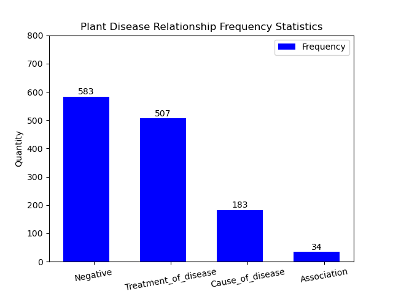
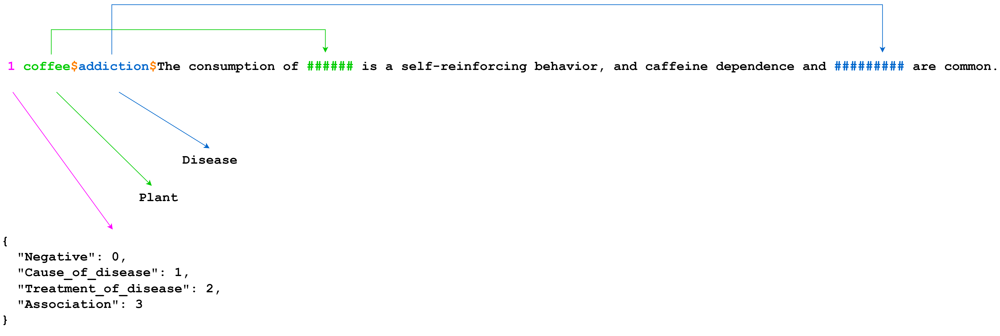

# Relation Extraction Plant-Disease Dataset

##  **`Slamet Riyanto S.Kom., M.M.S.I.`**

##  **`Dimas Dwi Putra`**

## Original
## [National Center for Biotechnology Information (NCBI)](https://www.ncbi.nlm.nih.gov/pmc/articles/PMC6713337/) 



## Labels
```yaml
{
  "Negative": 0,
  "Cause_of_disease": 1,
  "Treatment_of_disease": 2,
  "Association": 3
}
```

## Data Version 1


## Data Version 2


# **Other Content**

### **Websites Prediction**
#### [Django Websites Prediction For NER dan RE](https://github.com/Dimas263/Django-Websites_NER_RE)

<br>

### **Named Entity Recognition (NER)**
#### [NLP_NER_Dataset_Biomedical_Plant-Disease_Corpus](https://github.com/Dimas263/NLP_NER_Dataset_Biomedical_Plant-Disease_Corpus)
#### [NLP_NER_CRF_Named_Entity_Recognition](https://github.com/Dimas263/NLP_NER_CRF_Named_Entity_Recognition)
#### [NLP_NER_BILSTM_Named_Entity_Recognition](https://github.com/Dimas263/NLP_NER_BILSTM_Named_Entity_Recognition)
#### [NLP_NER_BERT_Named_Entity_Recognition](https://github.com/Dimas263/NLP_NER_BERT_Named_Entity_Recognition)
#### [NLP_NER_BILSTM_CRF_Named_Entity_Recognition](https://github.com/Dimas263/NLP_NER_BILSTM_CRF_Named_Entity_Recognition)
#### [NLP_NER_BERT_BILSTM_CRF_Named_Entity_Recognition](https://github.com/Dimas263/NLP_NER_BERT_BILSTM_CRF_Named_Entity_Recognition)

<br>

### **Relation Extraction (NER)**
#### [NLP_RE_Dataset_Biomedical_Plant-Disease_Corpus](https://github.com/Dimas263/NLP_RE_Dataset_Biomedical_Plant-Disease_Corpus)
#### [NLP_RE_BERT_Relation_Extraction_Biomedical](https://github.com/Dimas263/NLP_RE_BERT_Relation_Extraction_Biomedical)
#### [NLP_RE_BILSTM_CRF_Relation_Extraction_Biomedical](https://github.com/Dimas263/NLP_RE_BILSTM_CRF_Relation_Extraction_Biomedical)
